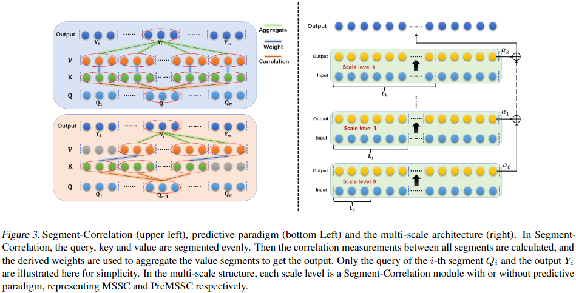

# Preformer

This repository contains the pytorch code for the paper "[Preformer: Predictive Transformer with Multi-Scale Segment-wise Correlations for Long-Term Time Series Forecasting](https://arxiv.org/pdf/2202.11356.pdf)”.

# Model
The core MSSC module:



# Acknowledgment

This repository uses some code from [Autoformer](https://github.com/thuml/Autoformer) and [Informer](https://github.com/zhouhaoyi/Informer2020). Thanks to the authors for their work!

# Get Started
## Environment

Install Python 3.6, PyTorch 1.9.0.

## Data

We use all the datasets provided by [Autoformer](https://github.com/thuml/Autoformer) directly, so you can download them from [Google drive](https://drive.google.com/drive/folders/1ZOYpTUa82_jCcxIdTmyr0LXQfvaM9vIy) provided in [Autoformer](https://github.com/thuml/Autoformer). All the datasets are well pre-processed and can be used easily. After downloading, put these dataset files (such as ETTh1.csv) in the `./data/` folder.


# Train

```
python run.py --is_training 1 --root_path ./data/ --data_path ETTh1.csv --model_id ETTh1_96_48 --model Preformer --data ETTh1 --features M --seq_len 96 --label_len 48 --pred_len 48 --e_layers 2 --d_layers 1 --factor 4 --enc_in 7 --dec_in 7 --c_out 7 --des 'Exp' --itr 1 --n_heads 4 --d_model 32 --d_ff 128
```

# Test

```
python run.py --is_training 0 --root_path ./data/ --data_path ETTh1.csv --model_id ETTh1_96_48 --model Preformer --data ETTh1 --features M --seq_len 96 --label_len 48 --pred_len 48 --e_layers 2 --d_layers 1 --factor 4 --enc_in 7 --dec_in 7 --c_out 7 --des 'Exp' --itr 1 --n_heads 4 --d_model 32 --d_ff 128
```

# Main Results


# Citation

```
@article{du2022preformer,
  title={Preformer: Predictive Transformer with Multi-Scale Segment-wise Correlations for Long-Term Time Series Forecasting},
  author={Du, Dazhao and Su, Bing and Wei, Zhewei},
  journal={arXiv preprint arXiv:2202.11356},
  year={2022}
}
```


